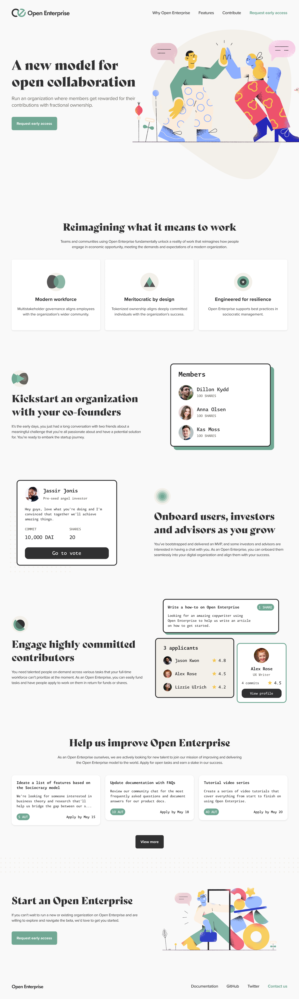
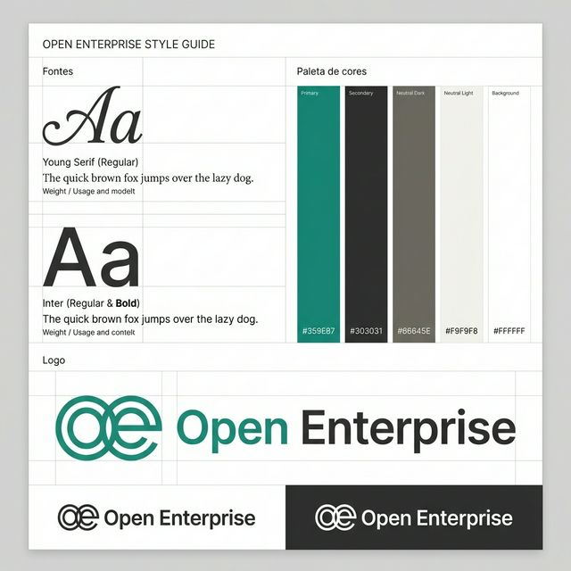

# Open Enterprise - Landing Page

Esta é uma implementação responsiva e moderna da landing page **Open Enterprise**, baseada nos designs oficiais do Figma. O projeto foca em acessibilidade, performance e uma experiência mobile impecável.

## 🚀 Tecnologias

| Tecnologia       |                                                             Logo                                                              | Descrição                                                      |
| :--------------- | :---------------------------------------------------------------------------------------------------------------------------: | :------------------------------------------------------------- |
| **React + TS**   |  | Base sólida para desenvolvimento de componentes tipados.       |
| **Vite**         |                                                               | Build tool extremamente rápida para o ecossistema web moderno. |
| **Stitches**     |                                | Solução de CSS-in-JS focada em performance e responsividade.   |
| **Google Fonts** |                  | Tipografias premium: `Young Serif`, `Inter` e `Space Mono`.    |

## 🛠️ Como Instalar e Rodar

1.  **Clone o repositório**:
    ```bash
    git clone [url-do-repositorio]
    ```
2.  **Instale as dependências**:
    ```bash
    npm install
    ```
3.  **Inicie o servidor de desenvolvimento**:
    ```bash
    npm run dev
    ```
4.  **Visualize o projeto**:
    Abra o link informado no terminal (geralmente `http://localhost:5173`).

## 📐 Design e Referências

O projeto foi construído seguindo rigorosamente estas referências:

- **[Figma Original](https://www.figma.com/community/file/839442424194047238)**
- **[Conceito de Landing Page](https://www.figma.com/design/MLvpEkHm8PO3ZDnlXGFJ9d/Landing-Page-Concept--Community-?node-id=0-1&p=f&m=dev)**

## 🖼️ Preview do Projeto



## 🎨 Guia de Estilo

Abaixo está a identidade visual oficial do projeto:



Para mais detalhes técnicos, consulte o documento: **[Style Guide](file:///home/andressa/.gemini/antigravity/brain/7a952a9c-8713-4109-a374-9ed15a411712/style_guide.md)**.
